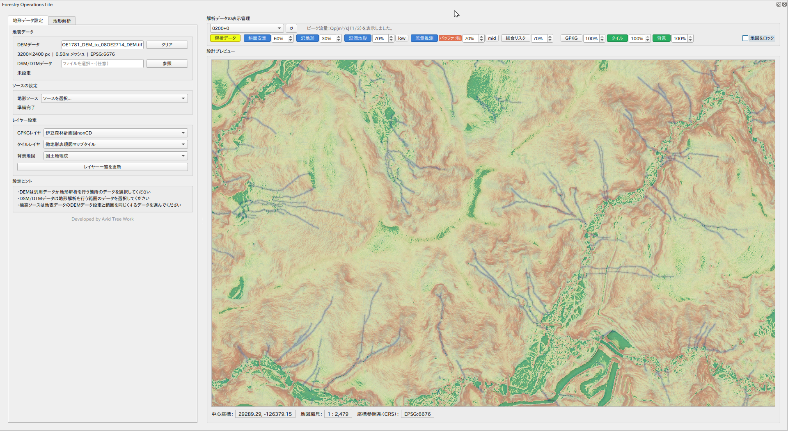
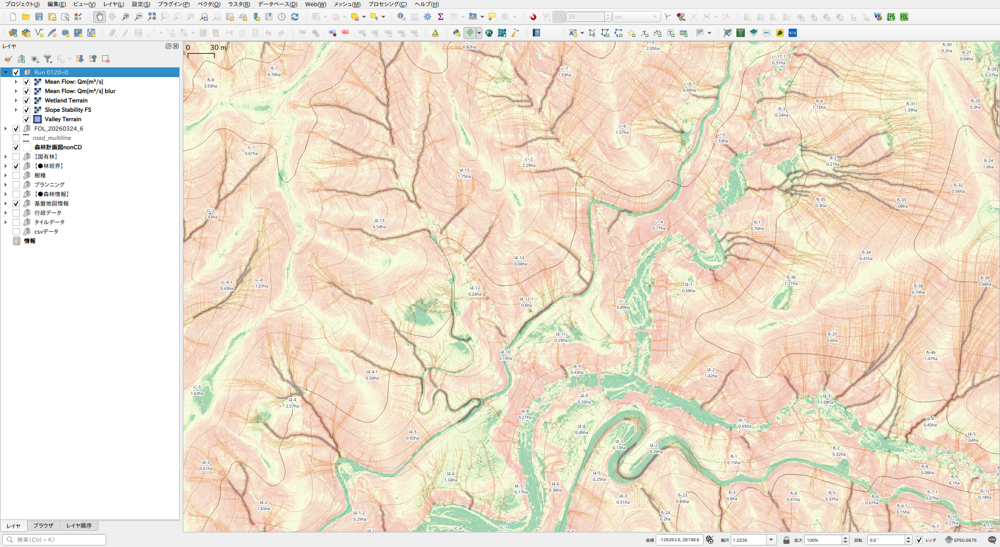

# Forestry Operations Lite

A QGIS plugin for terrain analysis supporting forestry site assessment.

---

## Features

- Load DEM / DSM from local files or XYZ tile services (GSI elevation tiles supported)
- Compute **slope**, **TWI** (Topographic Wetness Index), **stability index** (infinite-slope factor of safety), and **flow accumulation**
- Preview canvas with bidirectional sync to the QGIS main map window
- Layer settings (background / tile / GPKG) displayed in the preview independent of analysis data
- Map lock: fix the preview to the analysis extent while continuing to navigate the main window freely
- Analysis results are grouped and managed by run number in the QGIS layer panel

---

## Requirements

- QGIS 3.16 or later
- Python 3.7+
- numpy, GDAL (bundled with QGIS)

---

## Installation

1. Download the ZIP from [Releases](https://github.com/raw-slnc/forestry_operations_lite/releases)
2. In QGIS: **Plugins > Manage and Install Plugins > Install from ZIP**
3. The plugin appears in the **Vector toolbar** and **Vector menu**

---

## Usage

1. Click the **FOL** icon in the Vector toolbar to open the plugin window
2. Select a DEM/DSM source under **地形ソース** (Terrain Source)
3. Set background / tile / GPKG layers under **レイヤー設定** (Layer Settings)
4. Run terrain analysis — results are added to the QGIS layer panel grouped by run number
5. Toggle analysis layers on/off using the buttons in the preview panel

---

## License

This project is licensed under the GNU General Public License v2 or later.

---

## Support

If you find this plugin useful, your support is appreciated.
https://paypal.me/rawslnc

---

---

# Forestry Operations Lite（日本語）

林業サイトの地形解析を支援するQGISプラグインです。

---

## 機能

- ローカルファイルまたはXYZタイルサービス（国土地理院標高タイル対応）からDEM / DSMを読み込み
- **斜度**・**TWI**（地形湿潤指数）・**斜面安定性指数**（無限斜面安全率）・**流量推測**を計算
- QGISメインマップとの双方向同期プレビューキャンバス
- 解析データの有無に関わらず、レイヤー設定（背景・タイル・GPKG）をプレビューに表示
- 地図ロック：解析範囲にプレビューを固定しながら、メインウィンドウは自由に操作可能
- 解析結果はQGISレイヤーパネルに解析番号グループで管理

---

## 動作環境

- QGIS 3.16 以降
- Python 3.7+
- numpy、GDAL（QGIS同梱）

---

## インストール

1. [Releases](https://github.com/raw-slnc/forestry_operations_lite/releases) からZIPをダウンロード
2. QGISで **プラグイン > プラグインの管理とインストール > ZIPからインストール**
3. **ベクターツールバー**および**ベクターメニュー**にプラグインが追加されます

---

## 使い方

1. ベクターツールバーの **FOL** アイコンをクリックしてプラグインウィンドウを開く
2. **地形ソース** でDEM/DSMソースを選択
3. **レイヤー設定** で背景・タイル・GPKGレイヤーを設定
4. 地形解析を実行 — 解析結果は解析番号グループとしてQGISレイヤーパネルに追加
5. プレビューパネルのボタンで解析レイヤーの表示/非表示を切替

---

## ライセンス

GNU General Public License v2 以降

---

## サポート

開発を応援していただけると嬉しいです。
https://paypal.me/rawslnc
