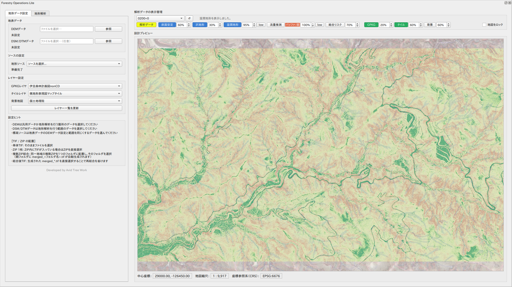
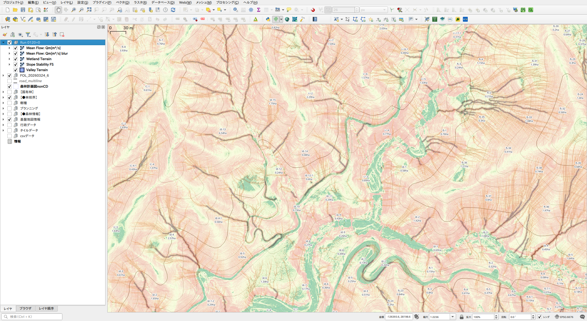
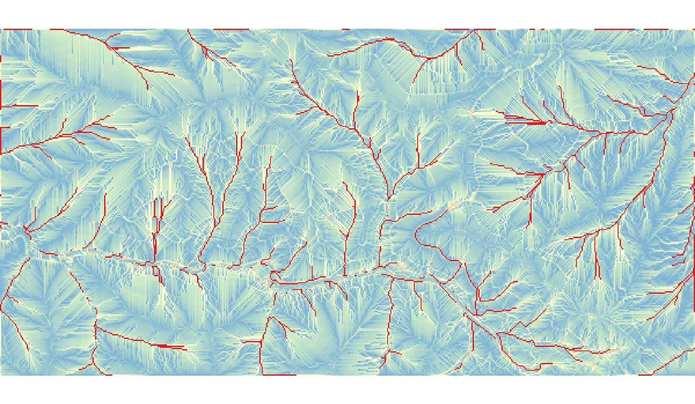
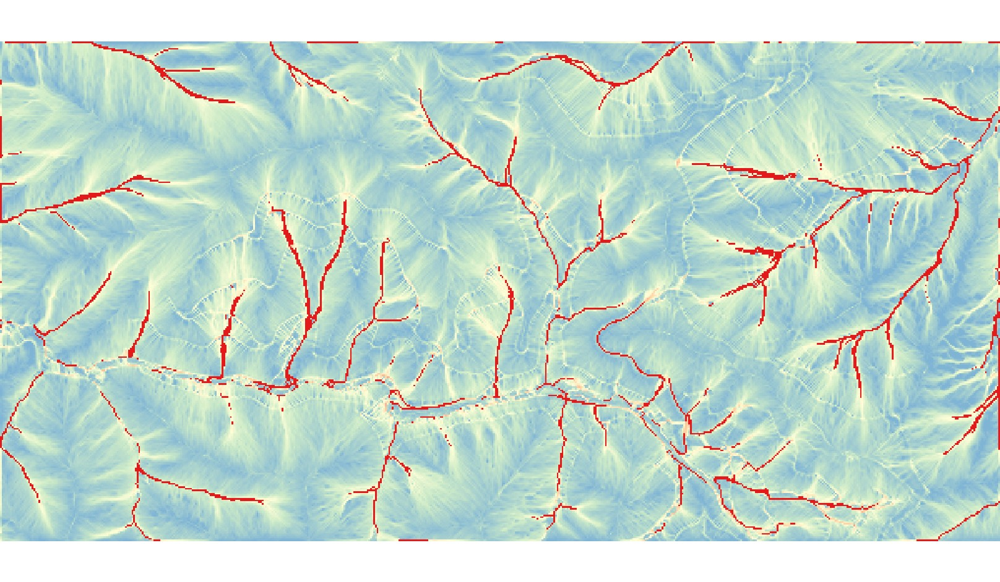
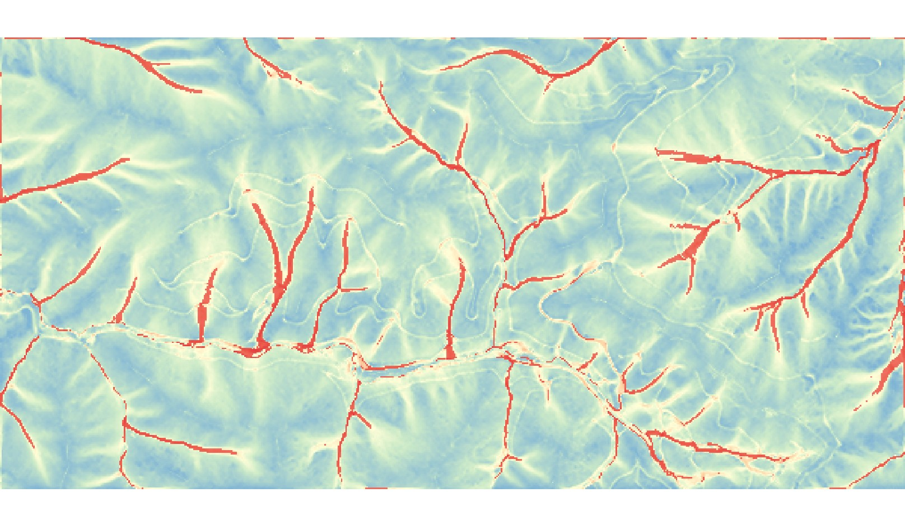

# Forestry Operations Lite

A QGIS plugin for terrain analysis supporting forestry site assessment.



---

## Features

- Load DEM from local files or tile services (GSI elevation tiles for Japan; AWS Terrarium for global coverage)
- Optional DSM — when loaded alongside DEM, canopy height is used to refine flow coefficients automatically
- Compute **slope stability** (infinite-slope factor of safety), **TWI** (Topographic Wetness Index), **valley terrain**, and **flow estimation**
- Preview canvas with bidirectional sync to the QGIS main map window
- Layer settings (background / tile / GPKG) displayed in the preview independent of analysis data
- Map lock: fix the preview to the analysis extent while continuing to navigate the main window freely
- Analysis results are grouped and managed by run number in the QGIS layer panel
- Preview status bar shows centre coordinates, scale, area (ha), and CRS



---

## Flow Direction Method (Valley / TWI)

The Valley Terrain analysis lets you choose how water flow is routed across the DEM when computing TWI and delineating valley zones. The choice is applied **to the Valley/TWI computation only** — flow estimation always uses D8. The three options trade off between a crisp channel line and a faithful wetness surface.

> ℹ️ **The images below are illustrative comparisons of how each method behaves — not analysis deliverables.** They were rendered on a sample DEM (resampled to 2 m) purely to show the difference; your actual output rasters/vectors are produced by running the analysis.

*Example renders on a sample DEM — for comparison only, not plugin outputs.*

| D8 | D∞ | MFD |
|---|---|---|
|  |  |  |
| **Single steepest** | **D-infinity** | **Multiple flow** |
| Water goes to one neighbour. Crisp single-line channels, but the TWI surface shows **striping artifacts**. | Flow split between two neighbours. **No striping**, valleys stay fairly sharp — a balanced middle ground. | Flow spread to all downslope cells. **Smoothest wetness surface**; valley zones follow the true valley bottom but look wider/fuzzier. |
| Best for **pinpointing where water concentrates** (danger lines, routing roads to avoid channels). | Best when you want **both a readable line and an artifact-free surface**. | Best for reading the **valley terrain itself** as a faithful area (wetness / disaster-risk surface). |

> **Note:** The TWI threshold that best separates valleys differs by method (the accumulation scale changes). Re-check the *TWI Threshold* after switching methods. In the example above, matching valley density required TWI ≈ 5.2 (D8), 5.4 (D∞), 5.9 (MFD).

---

## Virtual Shizuoka Features (Shizuoka Prefecture, Japan only)

These features use Virtual Shizuoka open data hosted on AWS S3 and are not available outside Shizuoka Prefecture.

- **VS LP/Grid 0.5 m DEM** — auto-fetched from S3 for the current canvas extent
- **Auto DSM** — selecting VS LP/Grid as DEM automatically fetches and sets VS LP/Ground as DSM; no manual DSM selection is needed
- **Export for WebODM Importer** — packages DTM, DSM, ortho, and LAS point cloud into a ZIP for use with the [WebODM Importer](https://github.com/raw-slnc/webodm_importer) plugin

### VS LP/Grid workflow

1. Click **Browse** under DEM Data and select **VS LP/Grid (0.5m)**
2. DEM tiles are fetched from S3 for the current canvas extent
3. Immediately after, DSM (VS LP/Ground LAS → GeoTIFF) is fetched automatically for the same extent
4. The DSM browse button is disabled while VS LP/Grid is active (DSM is managed automatically)
5. **Cancel** on the DEM row cancels both DEM and DSM operations
6. **Clear** on the DEM row clears both DEM and DSM

### Export for WebODM Importer

The **Export for WebODM Importer** section packages the loaded VS LP terrain data into a ZIP that the WebODM Importer plugin can load directly.

**Requirements:**
- WebODM Importer plugin must be installed (controls are disabled otherwise)
- DEM source must be VS LP/Grid (DSM is set automatically)

**What is included in the ZIP:**
- DTM — VS LP/Grid GeoTIFF (0.5 m)
- DSM — VS LP/Ground converted from LAS (0.5 m)
- Ortho — VS LP/Ortho tiles for the same tile range as DEM/DSM (skipped if not available)
- LAS point cloud — raw LAS files from DSM generation, packed into `odm_georeferencing/`

All data is fetched for the same tile range (determined at DEM load time), ensuring geographic consistency.

Use the **Open in WODMI** button to open the exported ZIP directly in the WebODM Importer panel.

---

## DEM Sources

| Source | Coverage | Resolution | Notes |
|--------|----------|------------|-------|
| GSI DEM1A | Japan | ~1 m | Auto-fetched from canvas extent |
| GSI DEM5A | Japan | ~5 m | Auto-fetched from canvas extent |
| GSI DEM10B | Japan | ~10 m | Auto-fetched from canvas extent |
| AWS Terrarium | Worldwide | ~2–10 m eq. | Auto-fetched from canvas extent |
| Local file | Any | As-is | GeoTIFF, ZIP, or folder |
| Copernicus GLO-30 | Worldwide | 30 m | Free account required (OpenTopography) |
| VS LP/Grid | Shizuoka Pref., Japan | 0.5 m | Auto-fetched from S3 — see Virtual Shizuoka Features |

### CRS recommendations

- Set the project CRS to the **UTM zone** covering your analysis area for best accuracy.
- UTM is valid up to ±84° latitude. Accuracy degrades above ±70° (Arctic/Antarctic regions are outside the intended use range).
- The plugin automatically corrects cell size for geographic CRS (EPSG:4326) and Web Mercator (EPSG:3857) inputs.

**UTM zone examples:**

| Region | Recommended CRS |
|--------|----------------|
| Japan (126–132°E) | EPSG:32653 |
| Japan (132–138°E) | EPSG:32654 |
| Japan (138–144°E) | EPSG:32655 |
| Peru / Bolivia (66–72°W) | EPSG:32719 |
| Peru / Bolivia (72–78°W) | EPSG:32718 |
| Southeast Asia | UTM zone for longitude |

---

## Requirements

- QGIS 4.0 or later
- Python 3.x (bundled with QGIS)
- numpy, GDAL, scipy (bundled with QGIS)

---

## Installation

1. Download the ZIP from [Releases](https://github.com/raw-slnc/forestry_operations_lite/releases)
2. In QGIS: **Plugins > Manage and Install Plugins > Install from ZIP**
3. The plugin appears in the **Raster toolbar** and **Raster menu**

---

## Usage

1. Click the **FOL** icon in the Raster toolbar to open the plugin window
2. Select a DEM source under **Terrain Data**
3. Set background / tile / GPKG layers under **Layer Settings**
4. Run terrain analysis — results are added to the QGIS layer panel grouped by run number
5. Toggle analysis layers on/off using the buttons in the preview panel

---

## Output Folder Structure

All output is written to `{project_folder}/forestry_operations_lite/`.
If the QGIS project has not been saved, `~/.qgis/forestry_operations_lite/` is used as a fallback.

```
forestry_operations_lite/
│
├── dem/                          # GSI / Terrarium tiles (GeoTIFF)
│   ├── gsi_dem5a_YYYYMMDD_HHMMSS.tif
│   └── gsi_dem5a_YYYYMMDD_HHMMSS_utm53.tif   ← reprojected to UTM
│
├── vs_lp_grid/                   # VS LP/Grid DEM tiles — Shizuoka only (GeoTIFF)
│   ├── {tile_code}.tif
│   └── vs_grid_YYYYMMDD_HHMMSS.tif           ← merged (multi-tile)
│
├── vs_lp_ground/                 # VS LP/Ground DSM tiles — Shizuoka only
│   ├── {tile_code}.las                        ← raw LAS point cloud
│   ├── {tile_code}_dsm.tif                   ← converted DSM
│   └── vs_dsm_YYYYMMDD_HHMMSS.tif            ← merged (multi-tile)
│
├── zip/                          # Export ZIPs for WebODM Importer — Shizuoka only
│   ├── FOL_YYYYMMDD-all.zip
│   └── FOL_YYYYMMDD_2-all.zip                ← sequential if same day
│
└── {run_number}/                 # Analysis results (e.g. 0011, 0012, 0010+2)
    ├── params.json               ← analysis parameters
    ├── stability_fs.tif          ← slope stability factor of safety
    ├── unstable_zones.gpkg       ← FS < threshold polygons
    ├── twi.tif                   ← Topographic Wetness Index
    ├── valley_zones.gpkg         ← valley / wetland zones (TWI threshold)
    ├── tc.tif                    ← time of concentration [h]
    ├── flow_peak.tif             ← peak discharge Qp [m³/s]
    ├── flow_mean.tif             ← mean discharge Qm [m³/s]
    ├── flow_vtotal.tif           ← total runoff volume V [m³]
    ├── integrated_risk_index.tif ← overall risk index (auto-generated)
    └── integrated_high_risk.gpkg ← high-risk area polygons
```

**Run number format:** `{seq:3d}{n_files:1d}` (e.g. `0011` = run 001, 1 file).
When more than 9 files: `{seq}0+{n-10}` (e.g. `0010+2` = run 001, 12 files).


---

## License

This project is licensed under the GNU General Public License v2 or later.

---

## Support

If you find this plugin useful, your support is appreciated.
https://paypal.me/rawslnc

---

---

# Forestry Operations Lite（日本語）

林業サイトの地形解析を支援するQGISプラグインです。

---

## 機能

- ローカルファイルまたはタイルサービス（国土地理院標高タイル・AWS Terrarium全球対応）からDEMを読み込み
- DSMオプション — DEMと併せて読み込むと、樹冠高から流出係数を自動算出
- **斜面安定性**（無限斜面安全率）・**TWI**（地形湿潤指数）・**沢地形**・**流量推測**を計算
- QGISメインマップとの双方向同期プレビューキャンバス
- 解析データの有無に関わらず、レイヤー設定（背景・タイル・GPKG）をプレビューに表示
- 地図ロック：解析範囲にプレビューを固定しながら、メインウィンドウは自由に操作可能
- 解析結果はQGISレイヤーパネルに解析番号グループで管理
- プレビューステータスバーに中心座標・縮尺・面積（ha）・CRSを表示

---

## 沢地形の流向方式（Valley / TWI）

沢地形（Valley Terrain）解析では、TWI計算と沢ゾーン抽出のときに**水の流し方（流向方式）**を選べます。この選択は**沢地形（TWI）にのみ**適用され、流量推測は常にD8です。3方式は「沢の線のくっきりさ」と「湿り分布の正確さ」のトレードオフになります。

> ℹ️ **下の画像は各方式の挙動の違いを示す説明用の比較図であり、解析成果物ではありません。** 違いを示すためだけにサンプルDEM（2mリサンプル）で描画したものです。実際の出力ラスタ／ベクタは解析を実行して生成されます。

*サンプルDEMでの描画例 — 比較用であり、プラグインの成果物ではありません。*

| D8 | D∞ | MFD |
|---|---|---|
|  |  |  |
| **単一最急（1方向）** | **D∞（Tarboton）** | **多方向（MFD）** |
| 水を1マスにだけ流す。沢が細い1本線でくっきり出るが、TWI面に**縦縞のアーティファクト**が出る。 | 隣接2マスに分けて流す。**縞が出ず**、沢の線もそこそこ残る中間型。 | 下り方向すべてに分配。**最もなめらかな湿り分布**。沢ゾーンは実際の谷底に沿うが太く曖昧に見える。 |
| **水が集まる危険筋を特定**したいとき（崩れやすい筋・道で避ける筋の把握）に向く。 | **線も残しつつ縞のない面**が欲しいときに向く。 | **沢地形そのものを面として正確に**見たいとき（湿り・災害リスク面）に向く。 |

> **注意：** 沢をうまく分ける最適なTWI閾値は方式ごとにズレます（集水のスケールが変わるため）。方式を切り替えたら *TWI Threshold* を再調整してください。上図では沢の量を揃えるのに TWI ≈ 5.2（D8）・5.4（D∞）・5.9（MFD）が必要でした。

---

## バーチャル静岡機能（静岡県限定）

AWS S3上のバーチャル静岡オープンデータを使用する機能です。静岡県外では利用できません。

- **VS LP/Grid 0.5m DEM** — 現在のキャンバス範囲のタイルをS3から自動取得
- **DSM自動設定** — DEMにVS LP/Gridを選択すると、VS LP/GroundがDSMとして自動取得・設定される（手動でのDSM選択は不要）
- **Export for WebODM Importer** — DTM・DSM・オルソ・LAS点群を [WebODM Importer](https://github.com/raw-slnc/webodm_importer) プラグイン向けZIPにエクスポート

### VS LP/Grid ワークフロー

1. DEM Data の **Browse** をクリックし、**VS LP/Grid (0.5m)** を選択
2. 現在のキャンバス範囲に対してS3からDEMタイルを取得
3. 取得完了後、同じ範囲のDSM（VS LP/Ground LAS → GeoTIFF）を自動取得
4. VS LP/Grid 使用中はDSM Browseボタンが無効（DSMは自動管理）
5. **DEM行のCancel** でDEM・DSM両方の処理をキャンセル
6. **DEM行のClear** でDEM・DSM両方をクリア

### Export for WebODM Importer

**Export for WebODM Importer** セクションでは、読み込み済みのVS LP地形データを [WebODM Importer](https://github.com/raw-slnc/webodm_importer) プラグインが直接読み込めるZIP形式にパッケージ化できます。

**使用条件：**
- WebODM Importer プラグインがインストールされていること（未インストール時はすべての操作が無効）
- DEMソースがVS LP/Gridであること（DSMは自動設定）

**ZIPに含まれるデータ：**
- DTM — VS LP/Grid GeoTIFF（0.5 m）
- DSM — VS LP/Ground からLAS変換したGeoTIFF（0.5 m）
- Ortho — DEM読込時と同じタイル範囲のVS LP/Ortho（対象外エリアはスキップ）
- LAS点群 — DSM生成時の生LASファイルを `odm_georeferencing/` に格納

DEM読込時のタイル範囲に基づいて全データが取得されるため、地理的整合性が保たれます。

**Open in WODMI** ボタンを押すと、エクスポートしたZIPをWebODM Importerパネルで直接開けます。

---

## DEMソース

| ソース | カバレッジ | 解像度 | 備考 |
|--------|-----------|--------|------|
| 国土地理院 DEM1A | 日本 | 約1 m | キャンバス範囲から自動取得 |
| 国土地理院 DEM5A | 日本 | 約5 m | キャンバス範囲から自動取得 |
| 国土地理院 DEM10B | 日本 | 約10 m | キャンバス範囲から自動取得 |
| AWS Terrarium | 全球 | 約2〜10 m相当 | キャンバス範囲から自動取得 |
| ローカルファイル | 任意 | 元データ準拠 | GeoTIFF・ZIP・フォルダ |
| Copernicus GLO-30 | 全球 | 30 m | 無料アカウント必要（OpenTopography） |
| VS LP/Grid | 静岡県 | 0.5 m | S3から自動取得 — バーチャル静岡機能参照 |

### CRS推奨

- 解析精度を高めるため、プロジェクトCRSを対象地域の**UTMゾーン**に設定してください。
- UTMは緯度±84°まで定義されています。±70°を超える高緯度（北極・南極圏）は想定使用範囲外です。
- 地理座標系（EPSG:4326）・Web Mercator（EPSG:3857）のDEMを使用する場合、セルサイズは自動補正されます。

**UTMゾーン例：**

| 地域 | 推奨CRS |
|------|---------|
| 日本（東経126〜132°） | EPSG:32653 |
| 日本（東経132〜138°） | EPSG:32654 |
| 日本（東経138〜144°） | EPSG:32655 |
| ペルー・ボリビア（西経66〜72°） | EPSG:32719 |
| ペルー・ボリビア（西経72〜78°） | EPSG:32718 |
| 東南アジア | 経度に対応するUTMゾーン |

---

## 動作環境

- QGIS 4.0 以降
- Python 3.x（QGIS同梱）
- numpy、GDAL、scipy（QGIS同梱）

---

## インストール

1. [Releases](https://github.com/raw-slnc/forestry_operations_lite/releases) からZIPをダウンロード
2. QGISで **プラグイン > プラグインの管理とインストール > ZIPからインストール**
3. **ラスターツールバー**および**ラスターメニュー**にプラグインが追加されます

---

## 使い方

1. ラスターツールバーの **FOL** アイコンをクリックしてプラグインウィンドウを開く
2. **Terrain Data** でDEMソースを選択
3. **レイヤー設定** で背景・タイル・GPKGレイヤーを設定
4. 地形解析を実行 — 解析結果は解析番号グループとしてQGISレイヤーパネルに追加
5. プレビューパネルのボタンで解析レイヤーの表示/非表示を切替

---

## 出力フォルダ構造

すべての出力は `{プロジェクトフォルダ}/forestry_operations_lite/` に書き込まれます。
QGISプロジェクトが未保存の場合は `~/.qgis/forestry_operations_lite/` にフォールバックします。

```
forestry_operations_lite/
│
├── dem/                          # 国土地理院 / Terrarium タイル（GeoTIFF）
│   ├── gsi_dem5a_YYYYMMDD_HHMMSS.tif
│   └── gsi_dem5a_YYYYMMDD_HHMMSS_utm53.tif   ← UTMに再投影済み
│
├── vs_lp_grid/                   # VS LP/Grid DEMタイル（静岡限定・GeoTIFF）
│   ├── {タイルコード}.tif
│   └── vs_grid_YYYYMMDD_HHMMSS.tif           ← マージ済み（複数タイル）
│
├── vs_lp_ground/                 # VS LP/Ground DSMタイル（静岡限定）
│   ├── {タイルコード}.las                     ← 生LAS点群
│   ├── {タイルコード}_dsm.tif               ← 変換済みDSM
│   └── vs_dsm_YYYYMMDD_HHMMSS.tif            ← マージ済み（複数タイル）
│
├── zip/                          # WebODM Importer向けエクスポートZIP（静岡限定）
│   ├── FOL_YYYYMMDD-all.zip
│   └── FOL_YYYYMMDD_2-all.zip                ← 同日2回目以降
│
└── {解析番号}/                   # 解析結果（例: 0011, 0012, 0010+2）
    ├── params.json               ← 解析パラメータ
    ├── stability_fs.tif          ← 斜面安定性（安全率）
    ├── unstable_zones.gpkg       ← 不安定ゾーンポリゴン（FS < 閾値）
    ├── twi.tif                   ← 地形湿潤指数（TWI）
    ├── valley_zones.gpkg         ← 沢地形・湿潤ゾーンポリゴン（TWI閾値）
    ├── tc.tif                    ← 到達時間 Tc [h]
    ├── flow_peak.tif             ← ピーク流量 Qp [m³/s]
    ├── flow_mean.tif             ← 平均流量 Qm [m³/s]
    ├── flow_vtotal.tif           ← 総流出量 V [m³]
    ├── integrated_risk_index.tif ← 統合リスク指標（自動生成）
    └── integrated_high_risk.gpkg ← 高リスクエリアポリゴン
```

**解析番号フォーマット：** `{連番3桁}{ファイル数1桁}`（例: `0011` = 第1回解析・1ファイル）
ファイル数が10以上の場合: `{連番}0+{n-10}`（例: `0010+2` = 第1回解析・12ファイル）


---

## サポート

開発を応援していただけると嬉しいです。
https://paypal.me/rawslnc

## ライセンス

GNU General Public License v2 以降

## 作者

Copyright (C) 2026 Hideharu Masai
